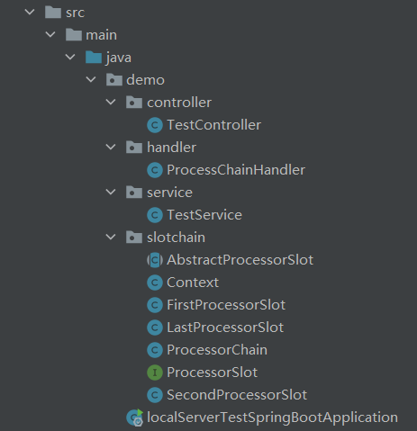

>在看Sentinel源码的时候发现其熔断/降级处理用到了责任链模式，
>在请求正式调用接口的具体方法前来按定义顺序执行相应操作，
>仿造其代码写了个简单的责任链模式demo。

### 代码结构


### 处理者 接口/抽象类/实现
```java
public interface ProcessorSlot {
    void enter(Context context,String resourceName);
    void skip(Context context,String resourceName);
    void finish(Context context,String resourceName);
}

public abstract class AbstractProcessorSlot implements ProcessorSlot{
    AbstractProcessorSlot next;

    @Override
    public void skip(Context context,String resourceName) {
        next.enter(context,resourceName);
    }

    @Override
    public void finish(Context context,String resourceName) {
        if(next!=null){
            next.finish(context,resourceName);
        }
    }
}

public class FirstProcessorSlot extends AbstractProcessorSlot{
    private static Map<String, AtomicInteger> map = new HashMap<>();
    @Override
    public void enter(Context context, String resourceName) {
        //自定义处理
        next.enter(context,resourceName);
    }
}

public class SecondProcessorSlot extends AbstractProcessorSlot{
    @Override
    public void enter(Context context, String resourceName) {
        //自定义处理
        next.enter(context,resourceName);
    }
}

public class LastProcessorSlot extends AbstractProcessorSlot{
    @Override
    public void enter(Context context, String resourceName) {
        //结束责任链
        finish(context,resourceName);
    }
}
```

### 责任链
```java
//其实就是一个单向链表
public class ProcessorChain {
    private AbstractProcessorSlot first;
    private AbstractProcessorSlot last;

    public ProcessorChain(AbstractProcessorSlot first) {
        this.first = first;
        this.last = first;
        addNext(new FirstProcessorSlot());
        addNext(new SecondProcessorSlot());
        addNext(new LastProcessorSlot());
    }

    public void addNext(AbstractProcessorSlot next){
        last.next=next;
        last=next;
    }

    public void execute(Context context,String resourceName){
        first.enter(context, resourceName);
    }
}
```
### Spring AOP 调用责任链
```java
@Aspect
@Component
public class ProcessChainHandler {
    @Pointcut("execution(* demo.service.TestService.*(..))")
    public void serviceAspect() {
    }

    @Around("serviceAspect()")
    public void serviceAround(ProceedingJoinPoint jpj) throws Throwable {
        Context serviceContext = new Context("default_service_context", Thread.currentThread().getName(), System.currentTimeMillis());
        String resourceName = jpj.getSignature().getName();
        ProcessorChain processorChain = new ProcessorChain(new AbstractProcessorSlot() {
            @Override
            public void enter(Context context, String resourceName) {
                skip(context, resourceName);
            }
        });
        processorChain.execute(serviceContext, resourceName);
        jpj.proceed();
    }
}
```

